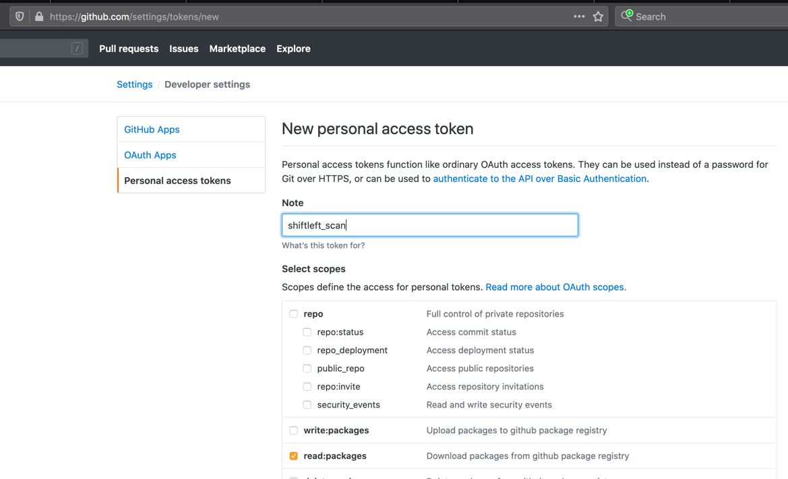

# Getting Started

scan is distributed as both a container [image](https://hub.docker.com/r/shiftleft/sast-scan) and as an [AppImage executable](https://github.com/ShiftLeftSecurity/sast-scan/releases). It is therefore easy to install, setup in the CI or locally, and then to run it.

## Scanning the Application Locally

### Pre-requisites

- Docker [desktop](https://www.docker.com/products/docker-desktop) in case of Windows and Mac
- For Linux, first [install](https://docs.docker.com/engine/install/) and then complete these [post-install](https://docs.docker.com/engine/install/linux-postinstall/) steps.

!!! Tip
    Scan works quite well with [podman](https://podman.io/) in both root and rootless mode on both Linux and on Windows with WSL2.

### Your first scan

=== "Linux and Mac"
    Invoking the `scan` command *detects* the language automatically and proceeds with a scan.
    <br>Easy one-liner command for some casual testing (Assuming this is fine for you)
    ```bash
    sh <(curl https://slscan.sh)
    ```
    <br>If you do not prefer such one-liners, use docker run command as shown below:
    ```bash
    docker run --rm -e "WORKSPACE=${PWD}" -v "$PWD:/app" shiftleft/sast-scan scan
    ```

    For project types such as Java, go compile the projects prior to scanning. Or pass `--build` to attempt automatic build.

    ```bash
    docker run --rm -e "WORKSPACE=${PWD}" -v "$PWD:/app" shiftleft/sast-scan scan --build
    ```

    For scanning a specific language project, use the `--type` option. For example, for scanning a python project,

    ```bash
    docker run --rm -e "WORKSPACE=${PWD}" -v "$PWD:/app" shiftleft/sast-scan scan --src /app --type python
    ```

=== "Apple M1 and arm64"
    For arm64 based CPU such as the Apple M1 CPU use the `:arm` tag.
    ```bash
    docker run --rm -e "WORKSPACE=${PWD}" -v "$PWD:/app" shiftleft/scan:arm scan
    ```

=== "Windows with WSL2"
    Follow these [instructions](wsl2.md) to run scan on Windows with WSL2 and podman.

    ```bash
    podman run --rm -e "WORKSPACE=${PWD}" -v "$PWD:/app" shiftleft/sast-scan scan
    ```

=== "Windows"
    On Windows use `%cd%` instead of \$PWD to run the scan with Command prompt

    ```cmd
    docker run --rm -e "WORKSPACE=%cd%" -v "%cd%:/app" shiftleft/sast-scan scan --src /app --type python
    ```

    powershell and powershell core

    ```powershell
    docker run --rm -e "WORKSPACE=$(pwd)" -e "GITHUB_TOKEN=$env:GITHUB_TOKEN" -v "$(pwd):/app" shiftleft/scan scan
    ```

    WSL bash

    ```bash
    docker run --rm -e "WORKSPACE=${PWD}" -e "GITHUB_TOKEN=${GITHUB_TOKEN}" -v "$PWD:/app" shiftleft/scan scan
    ```

    git-bash

    ```bash
    docker run --rm -e "WORKSPACE=${PWD}" -e "GITHUB_TOKEN=${GITHUB_TOKEN}" -v "/$PWD:/app" shiftleft/scan scan
    ```

    Don't forget the slash (/) before \$PWD for git-bash!

<br>

To scan multiple projects, separate the types with a comma. Here reports will be put in the directory specified by `--out_dir`

```bash
docker run --rm -e "WORKSPACE=${PWD}" -v $PWD:/app shiftleft/sast-scan scan --src /app --type credscan,nodejs,python,yaml --out_dir /app/reports
```

!!! Tip
    Scan container image can be referred to as either `shiftleft/sast-scan` or `shiftleft/scan`.

### Scanning Java Projects

> For Java and JVM projects, it is important to *compile* the projects before invoking sast-scan in the dev and CI workflow.

```bash
docker run --rm -e "WORKSPACE=${PWD}" -v <source path>:/app shiftleft/sast-scan scan --src /app --type java
```


### Language specific scans

=== "Credential scanning"
    ```bash
    sh <(curl https://slscan.sh/credscan)
    ```
    Or if you prefer direct docker run command.
    ```bash
    docker run --rm -e "WORKSPACE=${PWD}" -v "$PWD:/app" shiftleft/scan scan --src /app --type credscan
    ```

=== "Python"
    ```bash
    sh <(curl https://slscan.sh/python)
    ```
    Or if you prefer direct docker run command.
    ```bash
    docker run --rm -e "WORKSPACE=${PWD}" -v "$PWD:/app" shiftleft/scan scan --src /app --type python
    ```

=== "Dependency scanning"
    To perform dependency scanning, create a personal access token with `read:packages` scope from settings -> developer settings on github.
    
    Set this value as an environment variable called `GITHUB_TOKEN` and pass this value as shown.
    ```bash
    sh <(curl https://slscan.sh/depscan)
    ```
    Or if you prefer direct docker run command.
    ```bash
    docker run --rm -e "WORKSPACE=${PWD}" -e GITHUB_TOKEN -v "$PWD:/app" shiftleft/scan scan --src /app --type depscan
    ```

    !!! Note
    `GITHUB_TOKEN` is required even if you are planning to use scan with GitLab, Bitbucket and other providers. Dependency and license lookup for open-source packages is heavily traffic shaped by GitHub themselves and hence would not work without this token.

    To perform license compliance checks, use the environment variable `FETCH_LICENSE`.
    ```bash
    docker run --rm -e "WORKSPACE=${PWD}" -e GITHUB_TOKEN -e "FETCH_LICENSE=true" -v "$PWD:/app" shiftleft/scan scan --src /app --type depscan
    ```

    OSS risk audit along with dependency confusion checks is now supported for npm and pypi packages. To enable this, use the environment variables `ENABLE_OSS_RISK` and `PKG_PRIVATE_NAMESPACE` as shown.
    ```bash
    docker run --rm -e "WORKSPACE=${PWD}" -e "ENABLE_OSS_RISK=true" -e "PKG_PRIVATE_NAMESPACE=your org namespaces" -e GITHUB_TOKEN -v "$PWD:/app" shiftleft/scan scan --src /app --type depscan
    ```

    ```bash
    docker run --rm -e "WORKSPACE=${PWD}" -e "ENABLE_OSS_RISK=true" -e "PKG_PRIVATE_NAMESPACE=appthreat,shiftleft" -e GITHUB_TOKEN -v "$PWD:/app" shiftleft/scan scan --src /app --type depscan
    ```

=== "Node.js"
    Specify `nodejs` as the type.

    ```bash
    docker run --rm -e "WORKSPACE=${PWD}" -v "$PWD:/app" shiftleft/scan scan --src /app --type nodejs
    ```

    To include dependency scanning in addition to security audits include `depscan` as shown.

    ```bash
    docker run --rm -e "WORKSPACE=${PWD}" -v "$PWD:/app" shiftleft/scan scan --src /app --type nodejs,depscan
    ```

=== "go"
    Specify `go` as the type. To enable automatic build pass `--build` as a parameter.

    ```bash
    docker run --rm -e "WORKSPACE=${PWD}" -v "$PWD:/app" shiftleft/scan scan --src /app --type go --build
    ```

=== "IaC"
    Scan supports Infrastructure-as-Code (IaC) scans for Kubernetes, Terraform and AWS cloudformation.

    **Kubernetes**

    ```bash
    docker run --rm -e -v "$PWD:/app" shiftleft/scan scan --src /app --type kubernetes
    ```

    **Terraform**

    ```bash
    docker run --rm -e -v "$PWD:/app" shiftleft/scan scan --src /app --type terraform
    ```

    **AWS**

    ```bash
    docker run --rm -e -v "$PWD:/app" shiftleft/scan scan --src /app --type aws
    ```

    If using AWS CDK, export the project as cloudformation prior to scanning.


=== "PHP"
    Composer based projects are supported quite well by scan. For legacy projects, scan would attempt to create a `composer.json` file on-the-fly. Specify `php` as the type. To enable automatic build pass `--build` as a parameter.

    ```bash
    docker run --rm -e "WORKSPACE=${PWD}" -v "$PWD:/app" shiftleft/sast-scan scan --src /app --type php --build
    ```

    To include dependency scanning in addition to security audits include `depscan` as shown.

    ```bash
    docker run --rm -e "WORKSPACE=${PWD}" -v "$PWD:/app" shiftleft/sast-scan scan --src /app --type php,depscan --build
    ```

=== "Container Images"
    Scanning container images is now possible with slscan. The recommended approach is to export the container image using docker or podman save command first followed by an invocation of scan with the .tar file.

    Example: To scan an image called `shiftleft/scan-slim:latest` first pull and save the image. Then invoke scan with the tar file.

    ```bash
    docker pull shiftleft/scan-slim:latest
    docker save -o scanslim.tar shiftleft/scan-slim:latest
    # podman save --format oci-archive -o scanslim.tar shiftleft/scan-slim:latest
    docker run --rm -e "WORKSPACE=${PWD}" -v $PWD:/app shiftleft/scan scan --src /app/scanslim.tar -o /app/reports --type docker
    ```

    To enable, license and OSS risk audit, set the environment variables `FETCH_LICENSE` and `ENABLE_OSS_RISK`
    ```bash
    docker run --rm -e "WORKSPACE=${PWD}" -e "FETCH_LICENSE=true" -e "ENABLE_OSS_RISK=true" -v $PWD:/app shiftleft/scan scan --src /app/scanslim.tar -o /app/reports --type docker
    ```

    Alternatively, it is possible to let scan pull the container image before analysis. However, it requires exposing your docker or podman daemon socket which is insecure and therefore **not recommended**. You can try it if you are feeling adventurous by passing the below parameters to the docker run command.

    ```bash
    -e "DOCKER_HOST=unix:/var/run/docker.sock:" -v "/var/run/docker.sock:/var/run/docker.sock"
    ```

    Example: To scan the container image `shiftleft/scan-slim`:

    ```bash
    docker run --rm -e "WORKSPACE=$(pwd)" -e "DOCKER_HOST=unix:/var/run/docker.sock:" \
        -v "/var/run/docker.sock:/var/run/docker.sock" \
        -v "$(pwd):/app" shiftleft/scan scan -t docker -i shiftleft/scan-slim
    ```

    Example: To scan the container image `redmine@sha256:a5c5f8a64a0d9a436a0a6941bc3fb156be0c89996add834fe33b66ebeed2439e`:

    ```bash
    docker run --rm -e "WORKSPACE=$(pwd)" -e "DOCKER_HOST=unix:/var/run/docker.sock:" \
        -v "/var/run/docker.sock:/var/run/docker.sock" \
        -v "$(pwd):/app" shiftleft/scan scan -t docker -i redmine@sha256:a5c5f8a64a0d9a436a0a6941bc3fb156be0c89996add834fe33b66ebeed2439e
    ```

    Same example with podman

    ```bash
    podman run --rm -e "WORKSPACE=$(pwd)" -e "DOCKER_HOST=unix:/run/user/1000/podman/podman.sock:" \
        -v "/run/user/1000:/run/user/1000" \
        -v "$(pwd):/app" shiftleft/scan scan -t docker -i redmine@sha256:a5c5f8a64a0d9a436a0a6941bc3fb156be0c89996add834fe33b66ebeed2439e
    ```

Refer to the [readme](https://github.com/ShiftLeftSecurity/sast-scan#bundled-tools) for a complete list of all scan types.


## Scanning using AppImage on Linux

Scan is also distributed in AppImage format which is supported by major Linux distributions. To reduce the size, AppImage does not include Java Runtime (JRE) as well as tools such as Apache Maven and Gradle. All other features of scan are available and should work without any limitations.

### Easy installation

```bash
sh <(curl https://slscan.sh/install)
```

### Manual installation

- Download scan AppImage from GitHub releases
- Enable execute permission

```bash
sudo wget https://github.com/ShiftLeftSecurity/sast-scan/releases/download/v1.9.27/scan -O /usr/local/bin/scan
sudo chmod +x /usr/local/bin/scan
```
- Use from the terminal

```bash
scan -t nodejs
```

## Command-line arguments

```bash
usage: scan [-h] [-i SRC_DIR] [-o REPORTS_DIR] [-t SCAN_TYPE] [-c] [--build]
            [--no-error] [-m SCAN_MODE]

Wrapper for various static analysis tools

optional arguments:
  -h, --help            show this help message and exit
  -i SRC_DIR, --src SRC_DIR
                        Source directory
  -o REPORTS_DIR, --out_dir REPORTS_DIR
                        Reports directory
  -t SCAN_TYPE, --type SCAN_TYPE
                        Override project type if auto-detection is incorrect.
                        Comma separated values for multiple types. Eg:
                        python,bash,credscan
  -c, --convert         Convert results to sarif json format
  --build               Attempt to automatically build the project for
                        supported types
  --no-error            Continue on error to prevent build from breaking
  -m SCAN_MODE, --mode SCAN_MODE
                        Scan mode to use ci, ide, pr, release, deploy
```

All the arguments are _optional_ for scan.

## Environment variables

Scan use a number of environment variables for configuration and cutomizing the default behaviour.

| Variable          | Purpose                                                                                                                                |
| ----------------- | -------------------------------------------------------------------------------------------------------------------------------------- |
| WORKSPACE         | URL or the path to use for all references to the source code. Use blank to use relative path or in case of GitHub code scanning        |
| SCAN_ID           | Custom id to use for the scan run. Set this to match your CI job id or any other id to simplify integration                            |
| SCAN_AUTO_BUILD   | Enables automatic build using the bundled languages and runtime prior to scan. Supported languages are: java, kotlin, go, node.js, csharp, rust, php |
| SCAN_ANNOTATE_PR  | Set to true or 1 to enable automatic PR annotation. Defaults to true in case of GitHub actions. |
| SCAN_DEBUG_MODE | Setting this to `debug` would show debug output from individual tools. |
| BITBUCKET_TOKEN      | Bitbucket app password with `Pull Request: Read and Write` scope to enable pull request summary comment. Use along with SCAN_ANNOTATE_PR                   |
| GITHUB_TOKEN      | GitHub personal access token with `read:packages` scope to enable package lookup during dependency and license scans                   |
| GITLAB_TOKEN      | GitLab personal access token with `api` scope to enable merge request summary comment. Use along with SCAN_ANNOTATE_PR                   |
| REPOSITORY_URL    | Repository URL. Useful in cases when scan is trigger from a non-git based source such as an s3 bucket                                  |
| COMMIT_SHA        | Git commit hash. This is useful while scanning non-git based source                                                                    |
| BRANCH            | Git branch name. Automatically detected for git repositories. Specify this while scanning a folder or svn repository                   |
| CREDSCAN_DEPTH    | Number of commits to audit for secrets leak. Default 2                                                                                 |
| CREDSCAN_TIMEOUT  | Timeout for credscan. Default 2m                                                                                 |
| DISABLE_TELEMETRY | Set to false to enable telemetry. Set the telmetry url. Default value is true which disables telemetry. |
| TELEMETRY_URL | Set this value to a URL that will receive the telemetry json from scan invocations. Refer to [telemetry](../integrations/telemetry.md) |
| VDB_HOME | Directory to use for caching database. For docker based execution, this directory should get mounted as a volume from the host. Eg: `-e "VDB_HOME=/db" -v "/tmp:/db"` |
| NVD_START_YEAR | Default: 2018. Supports upto 1999 but increasing the year would increase the time and memory usage by depscan and may not work in CI environments |
| GITHUB_PAGE_COUNT | Default: 5. Supports upto 30 |
| SKIP_INSIGHTS | Set to true to skip insights rules which are usually security best-practices and not necessarily vulnerabilities (Python only) |
| WEB_ROUTE_ONLY | Set to true to force scan to consider only web routes. Improves quality (Python only) |
| FETCH_LICENSE | Set to true to fetch license details for OSS packages from public registries |
| ENABLE_OSS_RISK | Set to true to enable OSS risk audit in depscan (npm only) |
| PKG_PRIVATE_NAMESPACE | Comma separated list of private namespace to check for dependency confusion attacks during OSS risk audit. Use along with `ENABLE_OSS_RISK` variable |

## Suppression

Scan is optimized for reducing false positives and errors. But due to the nature of static analysis and limitations of the opensource scanners, there are times when scan produce clear false positives. We have seen this happening for python (bandit), JavaScript (njsscan) and even Java (FindSecBugs).

To suppress finding on a specific line, simply add a comment with the `scan:ignore` marker:

### Python example

Hash based comment is supported

```python
# scan:ignore
Line of code producing false positive
```

### JavaScript or Java example

Single and multi-line comment is supported

```javascript
Line of code producing false positive // scan:ignore
```

```java
Line of code producing false positive // scan:ignore or /* scan:ignore */ or // nosec
```

In addition to `scan:ignore` we support `nolint`, `nosec` and `sl:ignore` markers. Simply add any one of these as a comment.

!!! Note
    The marker should be added next to the exact line reported by scan. We currently do not support method or file level ignore.

## Baseline

Sometimes, your team might be interested in setting a baseline against the master/main or release branch and track only the new additions introduced by feature or epic branches.

It is effortless to setup baselines with scan. Scan would automatically create a file called `.sastscan.baseline` after every analysis. This file is a simple of list of two types of fingerprints (or hashes)

- Hash of the code snippet called `scanPrimaryLocationHash`
- Hash of the source-sink tags called `scanTagsHash` (Python only)

These fingerprints can also be found in the results in the [SARIF files](../integrations/sarif.md) under `partialFingerprints` section.

```json
"partialFingerprints": {
    "scanPrimaryLocationHash": "f35827a889ebadc4",
    "scanTagsHash": "e037139a5cd2951e",
    "scanFileHash": "8aca4cdbb13ad2dc"
},
```

Simply commit this file to the root directory of your repo. Every subsequent scans would suppress all the findings in the baseline file thus reporting only the new findings.

!!! Note
    Only SAST findings are supported in baseline. Support for depscan findings is coming shortly.

### Use cases

=== "Compare PR with main"
    Generate and commit the baseline file for your master/main branch scans. Subsequent feature branch scans would use only the new findings for breaking the builds. With GitHub action it might resemble this.

    ```yaml
    - name: Scan
      uses: ShiftLeftSecurity/scan-action@master
      env:
        WORKSPACE: https://github.com/${{ github.repository }}/blob/${{ github.sha }}
        GITHUB_TOKEN: ${{ secrets.GITHUB_TOKEN }}
        SCAN_AUTO_BUILD: true
      with:
        output: reports

    - name: Update scan baseline on main branch
      if: {{ github.ref == 'refs/heads/main' }}
      run: |
        cp reports/.sastscan.baseline .

        git config --global user.name "scan+github-actions[bot]"
        git config --global user.email "scan+github-actions[bot]@users.noreply.github.com"

        git add .sastscan.baseline
        git commit -m "Update scan baseline"
        git push
    ```

=== "Compare Release branches"
    Store the baseline files for your release branches and use any json diff tool to identify the difference.
