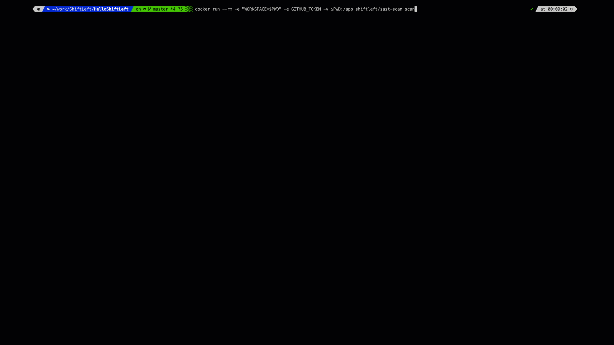

# Introduction


!!! WARNING
    Scan is now in maintenance mode. If you've just come across this project, then probably best to look at any alternatives. Read more [here](https://github.com/ShiftLeftSecurity/sast-scan/issues/352).

Scan (skæn) is an [open-source](https://github.com/ShiftLeftSecurity/sast-scan) security audit tool for modern DevOps teams. With an integrated multi-scanner based design, Scan can detect various kinds of security flaws in your application and infrastructure code in a single fast scan without the need for any _remote server_. The kind of flaws detected are:

* [x] Credentials Scanning to detect accidental secret leaks
* [x] Static Analysis Security Testing (SAST) for a range of languages and frameworks
* [x] Open-source dependencies audit for known CVEs
    - [x] Many languages and package formats [supported](getting-started/#language-specific-scans)
    - [x] OSS Risk Audit for npm
    - [x] Dependency confusion checks for npm
* [x] Licence violation checks
* [x] Container image scanning for application CVEs (New)

!!! Workflow
    Scan is purpose built for DevSecOps workflow [integrations](integrations) with nifty features such as automatic build breaker, Pull Request summary comments, GitHub [Code scanning](integrations/code-scan.md) and [Bitbucket](integrations/bitbucket.md) Code Insights support and so on.

## Sample invocation

Easy one-liner command below for some casual testing (Assuming this is fine for you):

```bash
sh <(curl https://slscan.sh)
```

The above command simply invokes the below docker run command.

```bash
docker run --rm -e "WORKSPACE=${PWD}" -v $PWD:/app shiftleft/sast-scan scan --build
```

### MD5 hashes for the scripts

| MD5 | Script | URL |
|-----|--------|-----|
| ad68b19ab0f01175df90b145451b1a1d | slscan.sh | https://slscan.sh |
| 3e90e3250f4e8a15c2b808fb00171cab | install | https://slscan.sh/install |
| 9a10d9115d7b096db7921231f9fedc47 | credscan | https://slscan.sh/credscan |

For arm64 based CPU such as Apple M1 use the `:arm` tag.

```bash
docker run --rm -e "WORKSPACE=${PWD}" -v $PWD:/app shiftleft/sast-scan:arm scan --build
```



Scan is also available as an AppImage. Please download the latest version from GitHub [releases](https://github.com/ShiftLeftSecurity/sast-scan/releases) or use the one-liner command below.

```bash
sh <(curl https://slscan.sh/install)
```

Expanded version of the one-liner command.

```bash
wget https://github.com/ShiftLeftSecurity/sast-scan/releases/download/v1.9.27/scan
chmod +x scan
./scan -t nodejs
```

## Supported Languages & Frameworks

Full list of supported languages is as follows:

| Language | Scan Type (--type) | Credential Scan | SAST | Dependency Scan | License Audit | Build Breaker |
|----------|-----------|---------------------|------|-----------------|---------------|---------------|
| Salesforce Apex     | apex | ✓ | ✓ | | | ✓ |
| Ansible     | ansible | ✓ | 🚧 | | | |
| AWS CloudFormation / CDK     | aws | ✓ | ✓ | | | ✓ |
| Azure Resource Manager Templates     | arm | ✓ | ✓ | | | ✓ |
| Bash     | bash | ✓ | ✓ | | | ✓ |
| C/C++     | cpp | ✓ | | 🚧 | | ✓ |
| Clojure     | clojure | ✓ | | ✓ | | ✓ |
| Dart     | dart | ✓ | | ✓ | | ✓ |
| Dockerfile | dockerfile | ✓ | ✓ | | | ✓ |
| Elixir     | elixir | ✓ | | ✓ | | ✓ |
| Go     | go | ✓ | ✓ | ✓ | ✓ | ✓ |
| Haskell     | haskell | ✓ | | ✓ | | ✓ |
| Java     | java | ✓ | ✓ | ✓ | ✓ | ✓ |
| Kotlin    | kotlin | ✓ | ✓ | ✓ | ✓ | ✓ |
| Scala    | scala | ✓ | ✓ | ✓ | ✓ | ✓ |
| Groovy    | groovy | ✓ | ✓ | ✓ | ✓ | ✓ |
| JSP     | jsp | ✓ | ✓ | ✓ | ✓ | ✓ |
| Node.js     | nodejs | ✓ | 🚧 | ✓ | ✓ | ✓ |
| PL/SQL     | plsql | ✓ | ✓ | | | ✓ |
| Php     | php | ✓ | ✓ | ✓ | ✓ | ✓ |
| Python     | python | ✓ | ✓ | ✓ | ✓ | ✓ |
| Ruby     | ruby | ✓ | ✓ (1) | ✓ | ✓ | |
| Rust     | rust | ✓ | | ✓ | ✓ | |
| Helm Charts     | yaml | ✓ | ✓ | | | ✓ |
| Kubernetes     | kubernetes | ✓ | ✓ | | | ✓ |
| Serverless     | serverless | ✓ | ✓ | | | ✓ |
| Terraform     | terraform | ✓ | ✓ | | | ✓ |
| Salesforce Visual Force    | vf | ✓ | ✓ | | | ✓ |
| Apache Velocity    | vm | ✓ | ✓ | | | ✓ |
| Yaml     | yaml | ✓ | 🚧 | | | |
| Container Image     | docker | ✓ | 🚧 | | | ✓ |

🚧 - Work-in-progress feature

!!! Note
	(1) - For Ruby, `brakeman` is the only supported tool and is currently not bundled with the scan image. Once you have a suitable license for brakeman (Not free for commercial use), run the below commands before invoking scan.

	```
	sudo gem install brakeman
	brakeman -q --no-exit-on-warn --no-exit-on-error -o reports/source-ruby-report.json
	```

	Scan would then take the json report `source-ruby-report.json` produced and use it for SARIF conversion and build breaker logic. The file should be produced in the reports directory before the invocation.

	To scan AWS CDK codebase, export to cloudformation and then scan using `aws` type.

## Start with your use case

=== "Integrate with CI/CD"
    - Explore the available [CI/CD integrations](integrations/README.md)
=== "Scan your Repos"
    - Use scan with [GitHub code scanning](integrations/code-scan.md)
    - Scan [GitLab](integrations/gitlab.md), [Bitbucket](integrations/bitbucket.md) and Azure [Repos](integrations/azure-devops-pipeline.md)
=== "Secure development"
    - Read more about [secure development](secure-development/README.md) and best practices with scan for a range of languages
    - Configure scan and [customize](integrations/tips.md) the default build breaker logic
=== "Advanced use cases"
    - Read more about the [SARIF format](integrations/sarif.md) used by scan for integration with any SARIF compliant SAST tool
    - Learn about the [Software Bill-of-Materials](integrations/sbom.md) report produced by scan
    - Learn about rolling out a [telemetry service](integrations/telemetry.md) to aggregate and audit scan invocations

## Support

Developers behind scan are available on a dedicated [discord channel](https://discord.gg/7WvSxdK) for questions and support. For defects, raising an issue on [GitHub](https://github.com/ShiftLeftSecurity/sast-scan/issues) is best.
