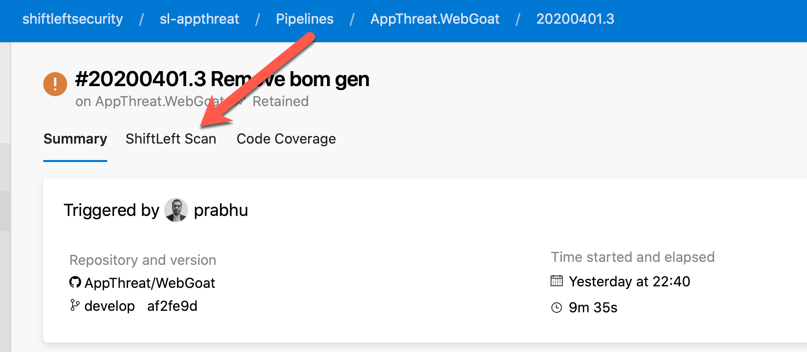
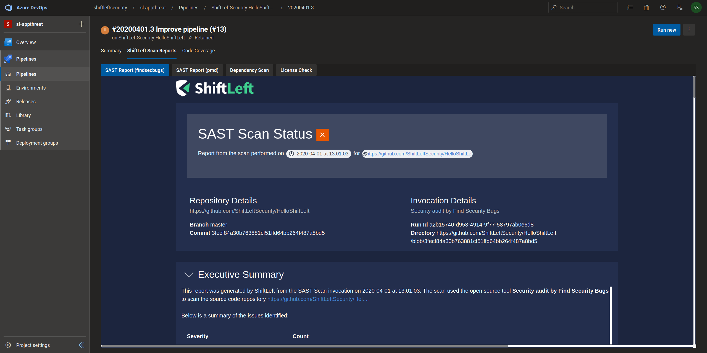
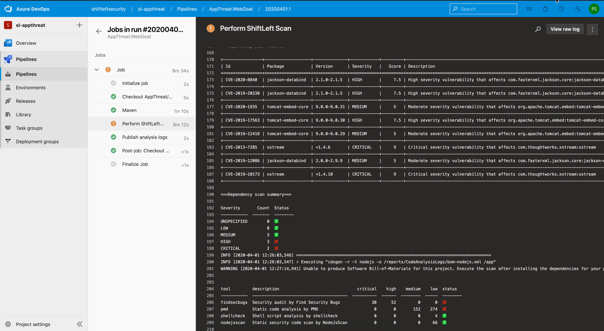

## Integration with Azure DevOps Pipelines

Scan has a best-in-class integration for Azure Pipelines with our dedicated [extension](https://marketplace.visualstudio.com/items?itemName=shiftleftsecurity.sl-scan-results). Below are the steps for integration with a yaml based pipeline:

- Install the extension to your Azure DevOps Organization. Ask your administrator for help if you do not have this permission.

- Simply add the following snippet to your build configuration YAML file (Usually azure-pipelines.yml).

```yaml
- script: |
    docker run \
      -e "VDB_HOME=/reports/vdb" \
      -v "$(Build.SourcesDirectory):/app" \
      -v "$(Build.ArtifactStagingDirectory):/reports" \
      -u $(id -u):$(id -g) \
      shiftleft/sast-scan scan --src /app --build \
      --out_dir /reports/CodeAnalysisLogs --no-error
  displayName: "Perform Scan"
  continueOnError: "true"

- task: PublishBuildArtifacts@1
  displayName: "Publish analysis logs"
  inputs:
    PathtoPublish: "$(Build.ArtifactStagingDirectory)/CodeAnalysisLogs"
    ArtifactName: "CodeAnalysisLogs"
    publishLocation: "Container"
```

- Trigger a build as normal and wait for it to complete.

- From the Pipelines page, select the most recent run. You should see a tab called **Scan** as shown below.

   

- Individual scan reports are shown as tabs as seen below. You can click on any tab to view and audit the different reports

   

- Summary would also be available in the build console logs for easy reference

   

### AppImage based execution (Linux agents)

Scan AppImage executable can be used with Ubuntu 20.04 linux agent. The small size helps reduce the total time compared to the docker based invocation.

Below is a sample configuration for a Java + Maven based project.

```yaml
trigger:
- master

pool:
  vmImage: 'ubuntu-20.04'

steps:
- task: Maven@3
  inputs:
    mavenPomFile: 'pom.xml'
    mavenOptions: '-Xmx3072m'
    javaHomeOption: 'JDKVersion'
    jdkVersionOption: '1.8'
    jdkArchitectureOption: 'x64'
    publishJUnitResults: false
    goals: 'compile'
- task: Bash@3
  displayName: Perform Scan
  inputs:
    targetType: 'inline'
    script: |
      sh <(curl https://slscan.sh/install)
      $HOME/.local/bin/scan -t java,depscan -o $(Build.ArtifactStagingDirectory)/CodeAnalysisLogs
  env:
    WORKSPACE: https://github.com/prabhu/struts2-rce/blob/$(Build.SourceVersion)
    GITHUB_TOKEN: $(GITHUB_TOKEN)

- task: PublishBuildArtifacts@1
  displayName: "Publish analysis logs"
  inputs:
    PathtoPublish: "$(Build.ArtifactStagingDirectory)/CodeAnalysisLogs"
    ArtifactName: "CodeAnalysisLogs"
    publishLocation: "Container"
```

Try using the AppImage format first. If there are errors or no results (Everything scanner reporting 0) then try the docker based execution.

### Container jobs based pipelines

By default, jobs run on the host machine where the agent is installed. This is convenient and typically well-suited for projects that are just beginning to adopt Azure Pipelines. On Linux and Windows agents, jobs may be run on the host or in a [container](https://docs.microsoft.com/en-us/azure/devops/pipelines/process/container-phases?view=azure-devops). Scan support such container jobs based pipelines. Use `container: shiftleft/sast-scan:latest` as shown.

```yaml
pool:
  vmImage: "ubuntu-latest"
container: shiftleft/sast-scan:latest
steps:
  # This integrates Scan with automatic build
  - script: scan --build --out_dir $(Build.ArtifactStagingDirectory)/CodeAnalysisLogs
    env:
      WORKSPACE: https://github.com/prabhu/HelloShiftLeft/blob/$(Build.SourceVersion)
      GITHUB_TOKEN: $(GITHUB_TOKEN)
    displayName: "Perform scan"
    continueOnError: "true"

  # To integrate with the Scan Extension it is necessary to publish the CodeAnalysisLogs folder
  # as an artifact with the same name
  - task: PublishBuildArtifacts@1
    displayName: "Publish analysis logs"
    inputs:
      PathtoPublish: "$(Build.ArtifactStagingDirectory)/CodeAnalysisLogs"
      ArtifactName: "CodeAnalysisLogs"
      publishLocation: "Container"
```

Further, by adding `--build` argument with scan command supported projects such as java, csharp, go or node.js can also be built on the fly thus speeding up the analysis. Please use container job based pipelines if your organization supports.

### Advanced configuration

You can improve the quality of the dependency scan (`--type depscan`) by passing a `GITHUB_TOKEN` as an environment variable. This token should have the following scopes:

- read:packages

```yaml
- script: |
    docker run \
      -e "GITHUB_TOKEN=$(GITHUB_TOKEN)" \
      -v "$(Build.SourcesDirectory):/app" \
      -v "$(Build.ArtifactStagingDirectory):/reports" \
      shiftleft/sast-scan scan --src /app \
      --out_dir /reports/CodeAnalysisLogs
  displayName: "Perform Scan"
  continueOnError: "true"
```

Refer to this [configuration](https://github.com/AppThreat/WebGoat/blob/develop/azure-pipelines-sl.yml) as an example.
