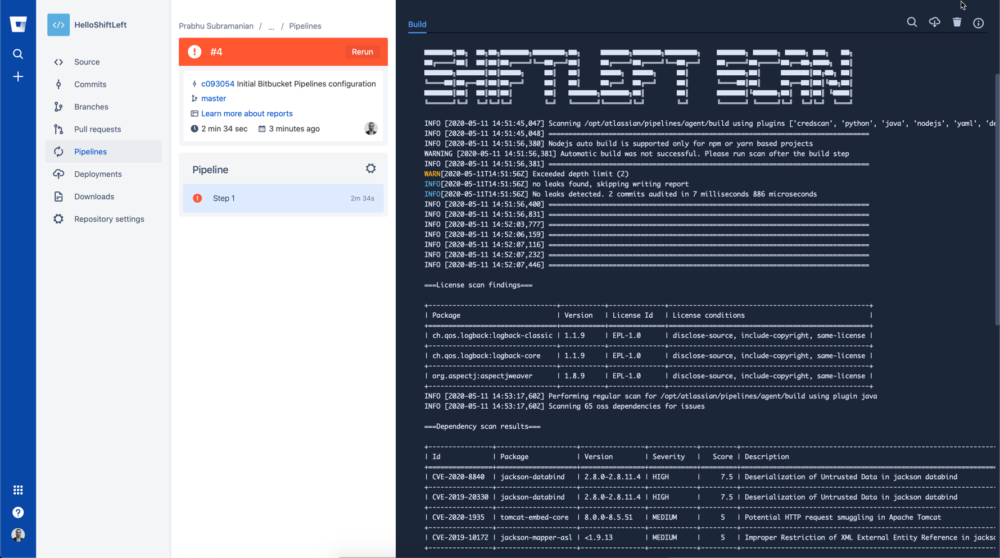
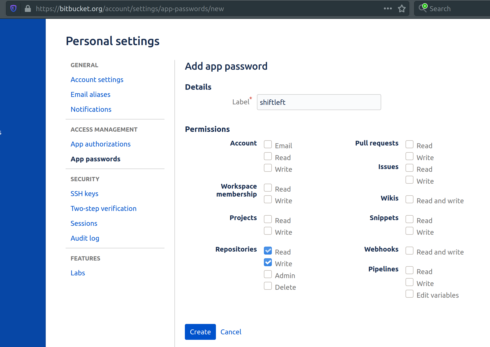
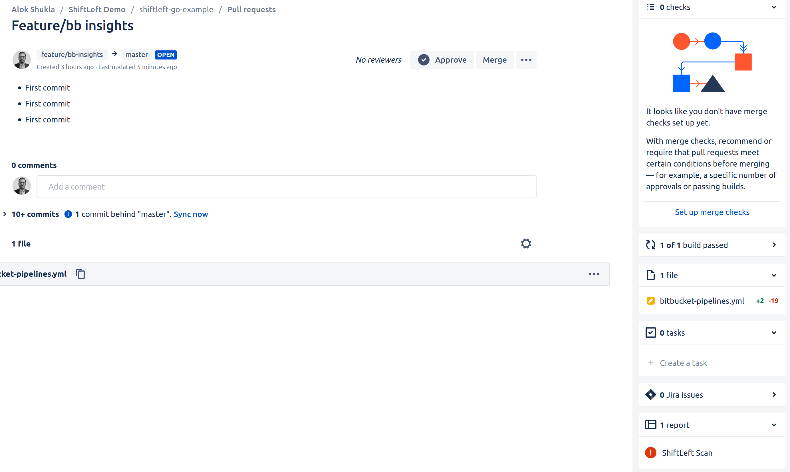
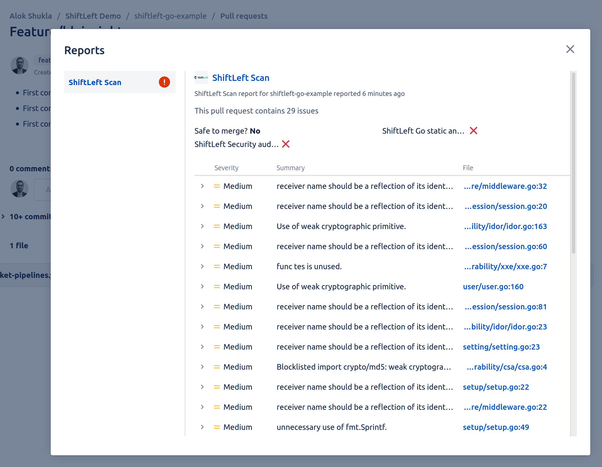

# Integration with Bitbucket Pipelines

Scan supports Bitbucket pipelines both via the docker image as well as with the AppImage. In addition, Scan can:

- Automatically add PR annotations via Bitbucket Code insights when a repository variable called `SCAN_ANNOTATE_PR` is set to either `true` or `1`
- Add Pull Request summary comments when an app password is passed as `BITBUCKET_TOKEN` repository variable along with `SCAN_ANNOTATE_PR`

Create a yaml file called `bitbucket-pipelines.yml` in the root directory of your project with the following configuration depending on your preference between docker and AppImage.

## Docker based step

```yaml
image: shiftleft/scan:latest

pipelines:
  default:
    - step:
        script:
          - scan --build
```

## AppImage based step

```yaml
pipelines:
  default:
    - step:
        script:
          - sh <(curl https://slscan.sh/install)
          - scan --build
```



!!! Tip
    To add environment variables such as WORKSPACE or GITHUB_TOKEN for scan, Use `Repository Variables` under `Repository Settings` and then `Pipelines`. Such variables would automatically get picked up by scan.

## Storing reports

Bitbucket pipelines has a pipe called `Bitbucket upload file` which can be used to store the scan reports for reference and auditing purposes. For example, assuming that scan reports were produced in a directory called `reports`, the below snippet can be used to upload the html file.

```yaml
- pipe: atlassian/bitbucket-upload-file:0.1.8
  variables:
    BITBUCKET_USERNAME: $BITBUCKET_USERNAME
    BITBUCKET_APP_PASSWORD: $BITBUCKET_APP_PASSWORD
    FILENAME: 'reports/source-report.html'
```

!!! Note
    This pipe requires an app password with `Repositories write and read` permissions. To create this password, go to [account settings](https://bitbucket.org/account/settings/) and click on `App passwords` and then `Create app password`.

    

The upload file pipe is quite basic supporting only one file. It is hence recommended to zip the `reports` directory to upload a single zip file containing all the reports. The full configuration is shown below:

```yaml
image: shiftleft/scan:latest

pipelines:
  default:
    - step:
        script:
          - scan --build --no-error
          - zip -r scan-reports.zip reports/
          - pipe: atlassian/bitbucket-upload-file:0.1.8
            variables:
              BITBUCKET_USERNAME: $BITBUCKET_USERNAME
              BITBUCKET_APP_PASSWORD: $BITBUCKET_APP_PASSWORD
              FILENAME: 'scan-reports.zip'
```

Follow this [link](https://bitbucket.org/prabhusl/helloshiftleft/src/master/bitbucket-pipelines.yml) for a full working pipeline.

## Automatic Code insights integration

By setting the Repository variable `SCAN_ANNOTATE_PR` to `true`, scan can automatically add the findings as Code insights. No further setup or pipe is necessary. Below are some example screenshots:

Scan report would show up in the right sidebar.


Selecting the report would present the insights view. The source code link can be clicked to see the problematic lines.


## Automatic Pull Request summary comment

Create an app password with Pull Request Read and Write scope. Set this password as the repository variable `BITBUCKET_TOKEN`. Also set the Repository variable `SCAN_ANNOTATE_PR` to `true`. Now for any Pull Request builds, scan can automatically create a pull request comment from the summary. Example configuration for a pull request build is below.

```yaml
image: shiftleft/scan

pipelines:
  pull-requests:
    '**':
      - step:
          script:
            - scan --build --no-error -t go
```

!!! Note
    Pull Request comments will not be created for default builds. This is due to certain PR related variables that gets set only during a Pull Request build. Code insights will be available for all builds.

To customize the message used for the comment, create a .sastscanrc file in the repo as suggested [here](tips.md) with the below config.

```json
{
  "PR_COMMENT_BASIC_TEMPLATE": "## Scan Summary\n%(summary)s\n## Recommendation\n%(recommendation)s\n"
}
```

- summary - Summary Table
- recommendation - One liner recommendation string (Hardcoded for now)

!!! Tip
    Markdown used by Bitbucket is quite specific and sensitive. Always try the markdown using the editor first prior to customizing it via the configuration file. Images via url is currently not suppored by Bitbucket.
