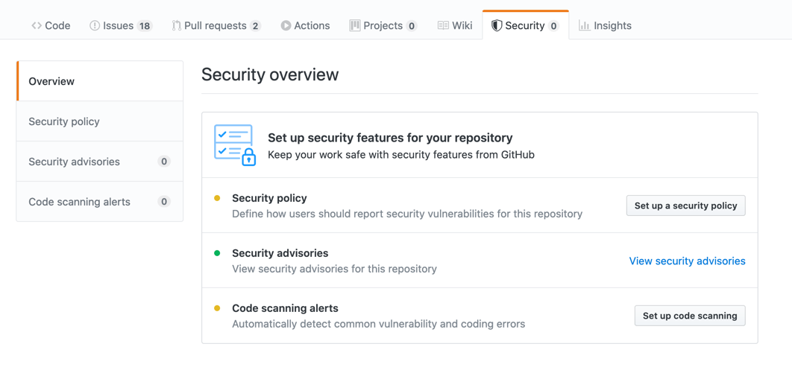
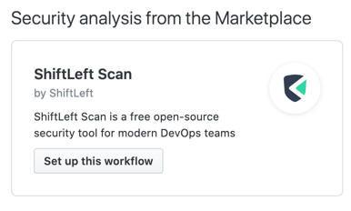
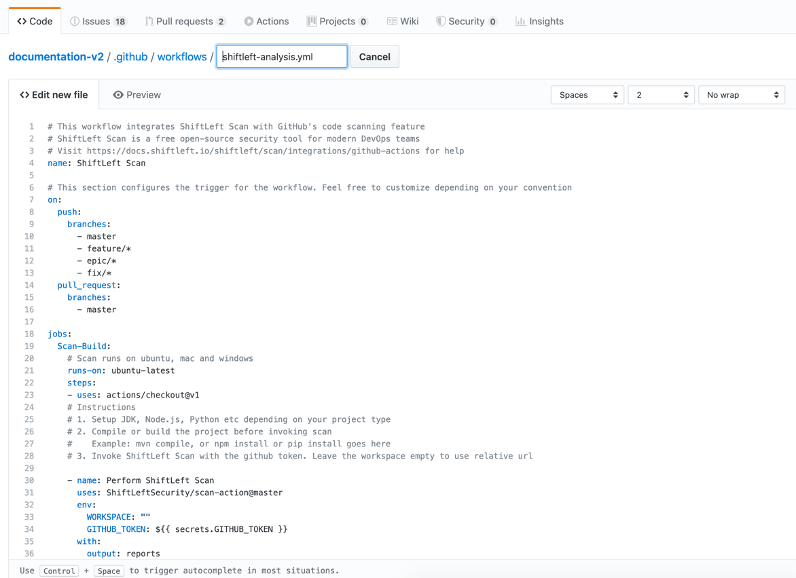

## Integration with Github code scanning

Scan [action](https://github.com/marketplace/actions/shiftleft-scan) can be integrated with GitHub code scanning tool.

Navigate to security settings on your repository and then to Code scanning alerts.

Register for beta access if required. Then look for scan on the marketplace integration.

A workflow integration file with the name `shiftleft-analysis.yml` will be presented. Save this file or configure based on the inline help provided in the workflow file.

Any subsequent build would be automatically scanned using scan. The findings will be viewable on the Code scanning alerts tab.

!!! tip
    Scan would automatically appear as a check for Pull Requests. No additional configuration is required!

Refer to this [example](https://github.com/ShiftLeftSecurity/tarpit-java/blob/master/.github/workflows/shiftleft-analysis.yml) for a complete workflow integrated with scan.
