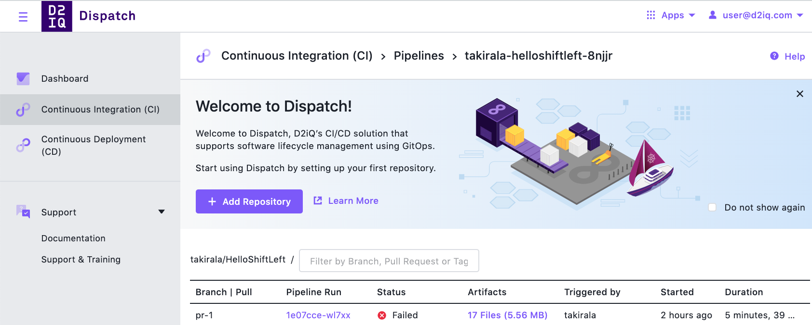
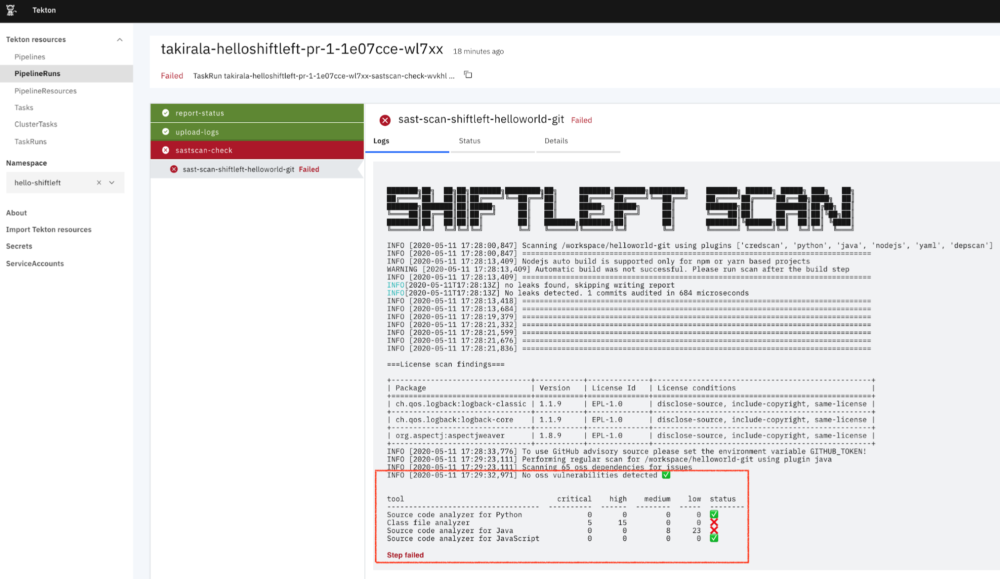

# Integration with D2iQ dispatch

Create a [Dispatchfile](https://docs.d2iq.com/ksphere/dispatch/1.1/pipeline-configuration/) in starlark, CUE, Json or Yaml format. The below example uses starlark format.

```python
#!mesosphere/dispatch-starlark:v0.5
# vi:syntax=python


#Load library to define a git resource and process a pull request
load("github.com/mesosphere/dispatch-catalog/starlark/stable/pipeline@master", "git_resource", "pull_request")

#Load library to execute Scan
load("github.com/shiftleftsecurity/sast-scan/starlark/scan@master", "sast_scan")

#Resources Define the git repo as a resource
git = git_resource("helloworld-git")

#Tasks that performs a Security Scan against the Resource
sast_scan("sastscan-check", git)

#Actions that trigger against any pull request or the chatops command /build
action(tasks=["sastscan-check"], on=pull_request())
action(tasks=["sastscan-check"], on=pull_request(chatops=["build"]))
```

While being brief, the pipeline, which is also stored in the application's repo, will perform a scan against the repository where the Dispatchfile resides. The libraries with the three functions "git_resource", "pull_request", and "sast_scan" are loaded at runtime. The pipeline can be triggered either by a pull request against the repository or by executing the ChatOps command "/build" against a pull request.

Next, open up a PR against the application repo and a webhook will be subsequently generated. This will trigger the pipeline to kick off on your running instance of Dispatch.

!!! Tip
    There are multiple ways to view the results of the pipeline via your Git provider or the Dispatch UI.

In the Dispatch UI, you can see the pipeline run status. In the below example, dispatch failed the pipeline run due to Scan determining that there were security flaws in the application.



Selecting the pipeline run takes you to the results of the Scan where you can see the results directly in the console.



## Using environment variables

To pass `GITHUB_TOKEN` to enable package lookups for dependency scan, pass `env` array as third argument while invoking `sast_scan` as shown:

```python
load("github.com/mesosphere/dispatch-catalog/starlark/stable/k8s@0.0.5", "secret_var")

sast_scan("sastscan-check", git, env=[
    k8s.corev1.EnvVar(name = "WORKSPACE", value = "$(context.git.url)"),
    k8s.corev1.EnvVar(name = "COMMIT_SHA", value = "$(context.git.commit)"),
    k8s.corev1.EnvVar(name = "BRANCH", value = "$(context.git.branch)"),
    k8s.corev1.EnvVar(name = "GITHUB_TOKEN", valueFrom = secret_var("scmtoken", "password"))
])
```

In the above snippet, `scmtoken` is the name of the Kubernetes secret and `password` is the key. `secret_var` function would then load the secret dynamically as an environment variable during execution.

```bash
$ dispatch login github --secret scmsecret --user hello --token world --namespace custom
INFO[0000] Creating 'Secret:default/scmsecret'
apiVersion: v1
data:
  password: d29ybGQ=
  scm.provider.name: Z2l0aHVi
  scm.provider.skiptlsverify: ZmFsc2U=
  scm.provider.url: aHR0cHM6Ly9hcGkuZ2l0aHViLmNvbQ==
  username: aGVsbG8=
kind: Secret
metadata:
  annotations:
    tekton.dev/git-0: https://github.com
  creationTimestamp: null
  name: scmsecret
  namespace: custom
type: kubernetes.io/basic-auth
---
```

You can create the secret manually using kubectl as well, it is a standard k8 secret and there is nothing special Dispatch CLI does except adding in the yaml template to make things easier. You can read more about credentials [here](https://docs.d2iq.com/ksphere/dispatch/1.1/credentials/).
