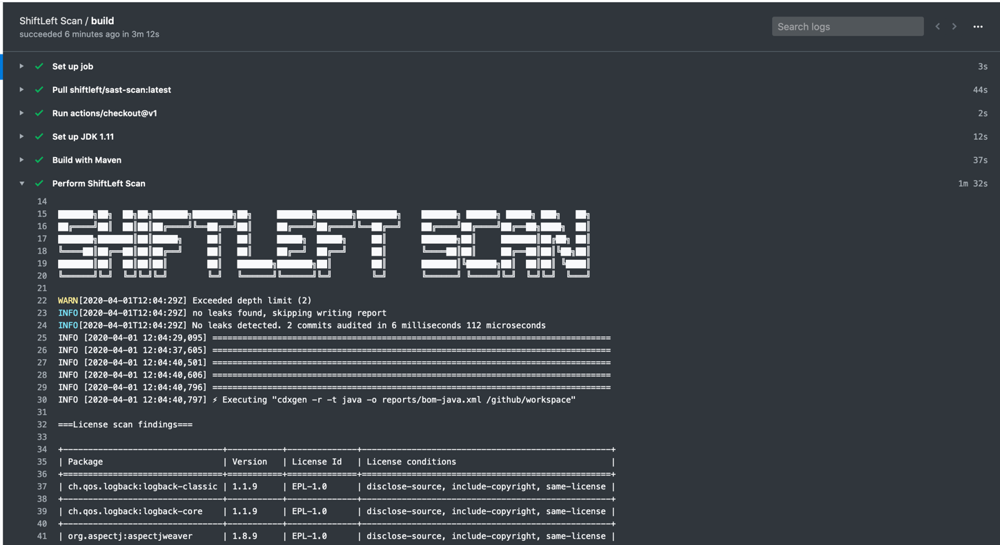
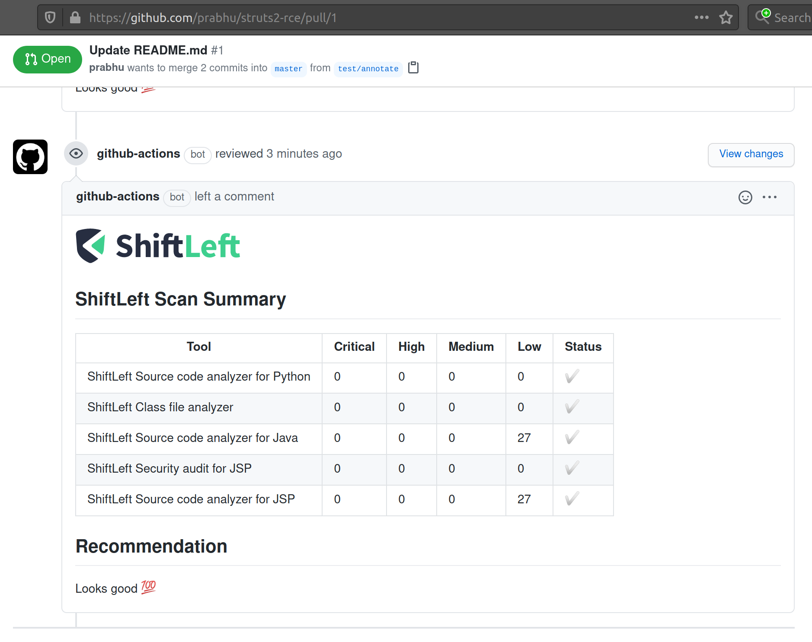

# Integration as Github Actions

Scan is available as a free GitHub action called [Security and Licence Scan](https://github.com/marketplace/actions/security-and-licence-scan)

A minimal setup configuration is shown below:

```yaml
- uses: ShiftLeftSecurity/scan-action@master
  with:
    type: "credscan,java,depscan"
```

An advanced configuration including the ability to cache the vulnerability database and to customize the WORKSPACE URL is below:

```yaml
- name: Cache vdb
  uses: actions/cache@v2
  with:
    path: |
      ${{ github.workspace }}/vdb
    key: ${{ runner.os }}
- name: Scan
  uses: ShiftLeftSecurity/scan-action@master
  env:
    VDB_HOME: ${{ github.workspace }}/vdb
    WORKSPACE: https://github.com/${{ github.repository }}/blob/${{ github.sha }}
    GITHUB_TOKEN: ${{ secrets.GITHUB_TOKEN }}
    SCAN_AUTO_BUILD: true
  with:
    output: reports
- name: Upload scan reports
  uses: actions/upload-artifact@v1.0.0
  with:
    name: shiftleft-scan-reports
    path: reports
```

Refer to this [example](https://github.com/ShiftLeftSecurity/HelloShiftLeft/blob/master/.github/workflows/slscan.yml) for a complete build pipeline.



## Automatic Pull Request comments

Scan can automatically add the summary as a comment to the GitHub Pull Requests. In addition, a status check and a label would also be created.



### Customization

To customize the message used for the comment, create a .sastscanrc file in the repo as suggested [here](tips.md) with the below config.

```json
{
  "PR_COMMENT_TEMPLATE": "## Scan Summary\n%(summary)s\n## Recommendation\n%(recommendation)s\n"
}
```

- summary - Summary Table
- recommendation - One liner recommendation string (Hardcoded for now)

### Disable comments

Set the environment variable `SCAN_ANNOTATE_PR` to false or 0 to disable this feature.
