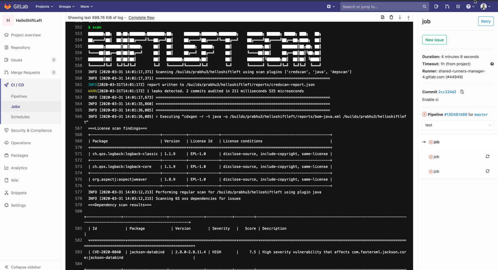

## Integration with Gitlab CI

ShiftLeft Scan scanning is available for all GitLab CI users including the free users. Simply add the below section to your `.gitlab-ci.yml` file

```yaml
job:
  image: shiftleft/sast-scan:latest
  script:
    - scan
```

To pass additional environment variables use the `environment` section as described [here](https://docs.gitlab.com/ee/ci/variables/where_variables_can_be_used.html)

Example for a python project with GITHUB_TOKEN

```yaml
variables:
  GITHUB_TOKEN: $GITHUB_TOKEN
scan:
  stage: test
  image:
    name: shiftleft/sast-scan
  script:
    - scan --src ${CI_PROJECT_DIR} --type credscan,python,depscan --out_dir ${CI_PROJECT_DIR}/reports
  artifacts:
    name: "$CI_JOB_NAME-$CI_COMMIT_REF_NAME"
    paths:
      - $CI_PROJECT_DIR/reports/
    when: always
```



Below is a configuration for a Java project with automatic build using `--build` argument.

```yaml
variables:
  GITHUB_TOKEN: $GITHUB_TOKEN
scan:
  stage: test
  image:
    name: shiftleft/sast-scan
  script:
    - scan --build --src ${CI_PROJECT_DIR} --type credscan,java,depscan --out_dir ${CI_PROJECT_DIR}/reports
  artifacts:
    name: "$CI_JOB_NAME-$CI_COMMIT_REF_NAME"
    paths:
      - $CI_PROJECT_DIR/reports/
    when: always
```
