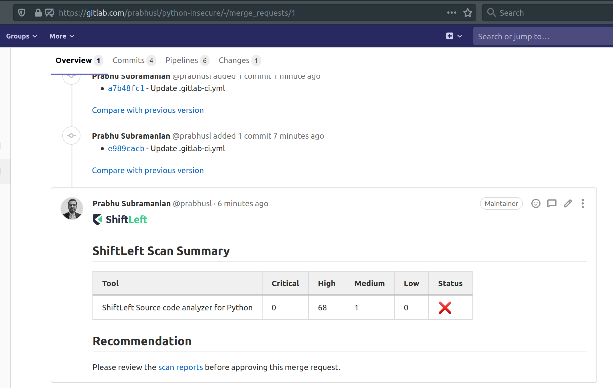

# Integration with GitLab CI

Scan is available for all GitLab CI users including the free users. In addition, it is possible to configure scan to add notes/comments to merge requests.

Simply add the below section to your `.gitlab-ci.yml` file

```yaml
job:
  image: shiftleft/sast-scan:latest
  script:
    - scan --build
```

To pass additional environment variables use the `environment` section as described [here](https://docs.gitlab.com/ee/ci/variables/where_variables_can_be_used.html)

Example for a python project with GITHUB_TOKEN

```yaml
variables:
  GITHUB_TOKEN: $GITHUB_TOKEN
scan:
  stage: test
  image:
    name: shiftleft/sast-scan
  script:
    - scan --src ${CI_PROJECT_DIR} --type credscan,python,depscan --out_dir ${CI_PROJECT_DIR}/reports
  rules:
    - when: always
  artifacts:
    name: "$CI_JOB_NAME-$CI_COMMIT_REF_NAME"
    paths:
      - $CI_PROJECT_DIR/reports/
    when: always
```


Below is a configuration for a Java project with automatic build using `--build` argument.

```yaml
variables:
  GITHUB_TOKEN: $GITHUB_TOKEN
scan:
  stage: test
  image:
    name: shiftleft/sast-scan
  script:
    - scan --build --src ${CI_PROJECT_DIR} --type credscan,java,depscan --out_dir ${CI_PROJECT_DIR}/reports
  rules:
    - when: always
  artifacts:
    name: "$CI_JOB_NAME-$CI_COMMIT_REF_NAME"
    paths:
      - $CI_PROJECT_DIR/reports/
    when: always
```

## Merge Request comment feature


Set the following Repository variables to enable merge request notes/comment feature.

- `SCAN_ANNOTATE_PR` to `true`
- GITLAB_TOKEN - Personal access token belonging to a user with `api` scope. Best is to create a separate build user and a token
- GITHUB_TOKEN - To enable dependency and licence scanning

Below are the full configuration and example screenshots:

```yaml
variables:
  GITHUB_TOKEN: $GITHUB_TOKEN
  GITLAB_TOKEN: $GITLAB_TOKEN
  SCAN_ANNOTATE_PR: "true"

scan:
  stage: test
  image:
    name: shiftleft/sast-scan:gl-insights
  script:
    - scan --src ${CI_PROJECT_DIR} --type python,depscan --out_dir ${CI_PROJECT_DIR}/reports
  rules:
    - when: always
  artifacts:
    name: "$CI_JOB_NAME-$CI_COMMIT_REF_NAME"
    paths:
      - $CI_PROJECT_DIR/reports/
    when: always
```



To customize the message used for the comment, create a .sastscanrc file in the repo as suggested [here](tips.md) with the below config.

```json
{
  "PR_COMMENT_TEMPLATE": "## Scan Summary\n%(summary)s\n## Recommendation\n%(recommendation)s\n"
}
```

- summary - Summary Table
- recommendation - One liner recommendation string (Hardcoded for now)
