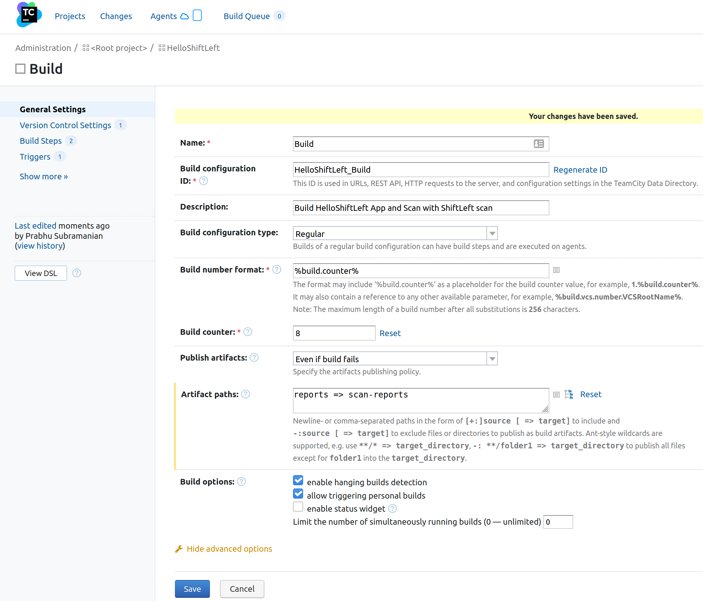
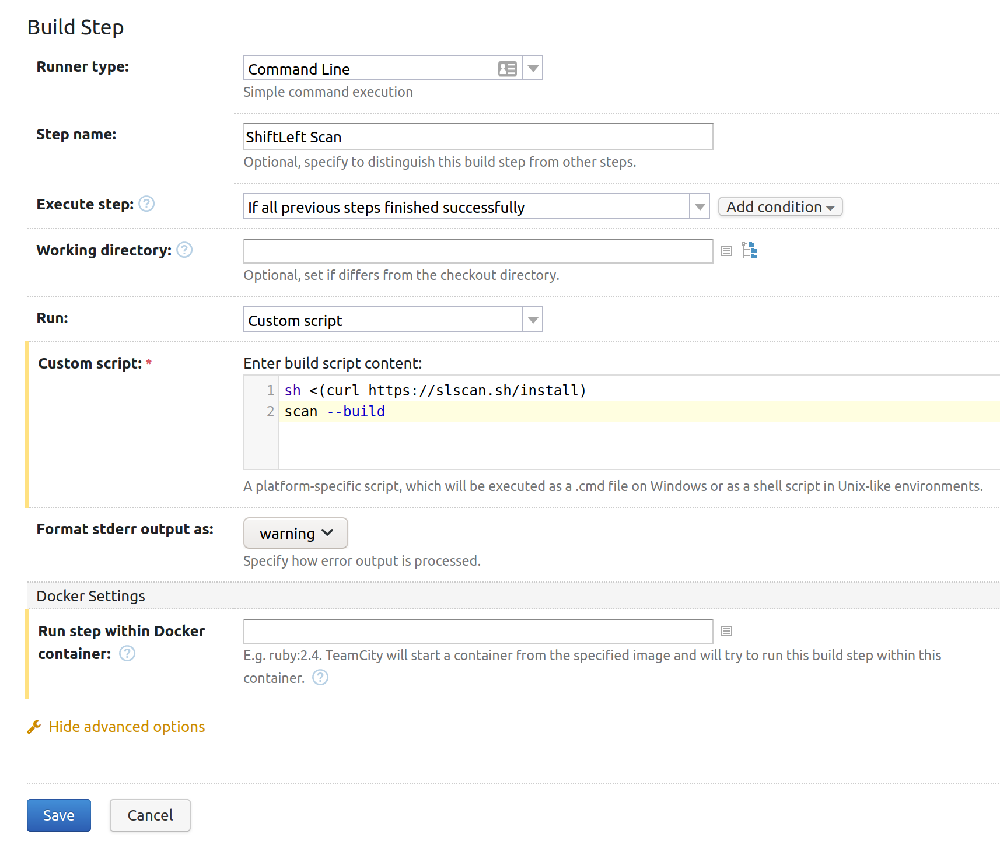
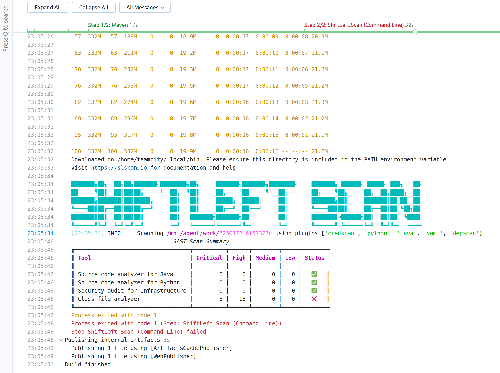

# Integration with TeamCity

Scan's AppImage format can be used with TeamCity cloud build service for performing security scans.

Create a Build configuration with the parameters shown below. The important configuration is the `Artifact paths`. Specify the value `reports => scan-reports`



Create a command line build step with the following custom script.

```bash
#!/usr/bin/env bash
sh <(curl https://slscan.sh/install)
$HOME/.local/bin/scan --build
```

The sh command is a one-liner command to download and install the latest scan AppImage from GitHub releases. You can also replace these steps with downloading from GitHub releases.

```bash
sudo wget https://github.com/ShiftLeftSecurity/sast-scan/releases/download/v1.9.27/scan -O $HOME/.local/bin/scan
sudo chmod +x $HOME/.local/bin/scan
```



Optionally, customize the build triggers using the Triggers menu. Use the parameters menu and Environment Variables section to pass any variables such as:

- GITHUB_TOKEN - Required for dependency and license scanning
- WORKSPACE - To customize the URL for the filenames in the output

Scan summary can be viewed directly in the build logs. Scan Reports can be downloaded from the `Artifacts tab -> scan-reports` directory.


